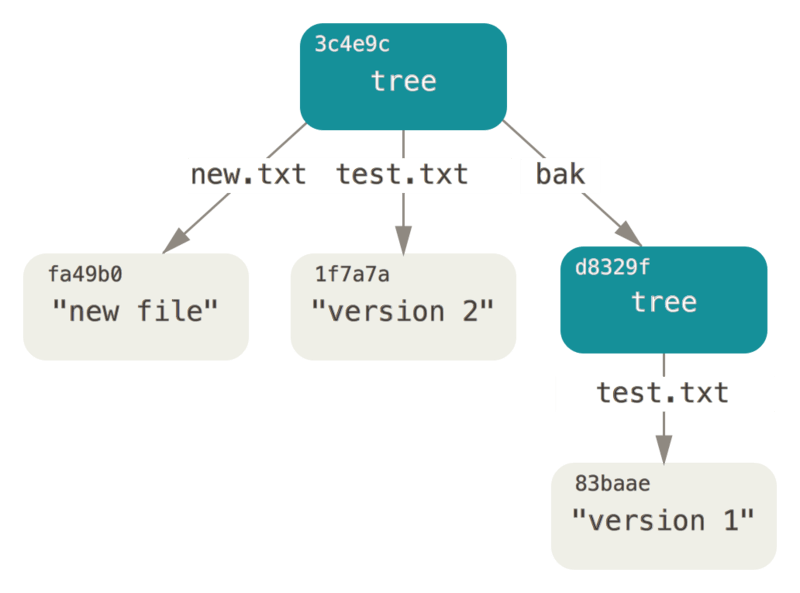

# Git 底层原理


在阅读本篇之前, 确保你已经安装好了 Git 并且配置了`.gitconfig` (邮箱及用户等).


## 为什么要学习 Git?

动机: 怎么多人协作?

* 不是像几个人做英语的小组作业那样灾难
  * 一个文件被传几遍. 改了什么内容?
  * 这段文案是谁改的...? 为啥要改?
  * ...

<figure><figcaption><p>没有版本控制的灾难</p></figcaption></figure>

有了版本管理系统(VCS)就能解决大部分上面的问题.

* 别人都干了些啥?
* 同步项目
* 解决并行开发引起的冲突

我不和别人协作!

* 项目快照
* 记录改动目的
* 多分支并行开发

如果愿意, 你也可以用 Git 打造专属自己的一套[个人笔记系统](https://orangex4.cool/post/lesson-zero-for-cs-students/)!

<figure><figcaption><p><a href="https://xkcd.com/1597/">XKCD 漫画</a>, 自嵌</p></figcaption></figure>

* Git 这么强大, 那要怎么实现 Git?
* 这是我该问的问题吗?
  * 为Git祛魅: [Write Yourself a Git!](https://wyag.thb.lt/) 563 行 Python 代码实现了 Git 的底层机制.

大部分的 Git 教程通常都是自上而下的: 从命令行接口开始, `git add/commit/push/fetch/pull`...

看起来你学到了很多, 但事实上, 你还是一个接口侠(_这也是我们后端最不愿意看到的_). 或者, 一旦学深入, 就不得不涉及到一些底层的原理. Git 被人诟病 "leaky abstraction", 就是因为它的接口太过丑陋 (就连Linus 本人也吐槽这一点).

虽然说现代 IDEs (例如Jetbrain, vscode) 已经提供了 Git 图形化的界面, 但是这不妨碍很多人依然不会.


什么是 leaky abstraction 泄露抽象?&#x20;

简单来说, 抽象层次的不完全封装, 导致底层细节和实现细节对上层抽象产生意外影响或泄漏出来, 这就是泄露抽象.

举一个例子, `matching_user(id:int)`是你写的一个匹配指定用户的函数, 你只需要传入用户 `id` 即可完成匹配, 但如果你写成 `matching_user(pattern:SQL_query)`, 这个接口就是泄露抽象的.

作为一名合格的后端人员, 你应当避免泄露抽象的出现.


本次的介绍会从 Git 的底层设计和模型开始讲起.

* Git 的后端模型很简洁.
* 理解一定的原理, 至少能让你在复制命令的时候不会感到一脸茫然.

## Git 的底层原理

### 存储结构

* 文件内容: Blob 对象 (**B**inary **L**arge **OB**ject)
* 对象: 对象按照 [SHA1-Hash](https://en.wikipedia.org/wiki/SHA-1#Data\_integrity) 寻址
* **Git 的一切都是对象**

不同于传统的文件存储系统: key-value

* 文件的内容是 value
* 文件或目录有一个唯一的名称/路径作为 key

你不是修改了文件, 而是**在另一个位置新建了文件**

* 文件的内容是 value
* 根据内容计算一个 hash key, 这个哈希值相当于路径
* 这就是 Git 的后端模型: 内容寻址文件系统(IPFS) (_听起来很吓人_)


什么是哈希函数? `strlen()` 就是一个哈希函数, 你可以知道字符串的长度, 但永远不知道原字符串是长什么样的. 你可以想象哈希函数就是_数据的身份证_, 它唯一, 并且不可逆. 利用这些特点, SHA-1哈希值就是一个对象的唯一标识符.


## 示例1: `git hash-object/cat-file`

这个示例中我们会演示两个"底层" (plumbing) 的指令: `git hash-object` 和 `git cat-file`. 即便这两个命令在我们日常使用中_几乎_不会见到, 但是对于我们了解 Git 的底层机制来说是很有用的.

在这个示例中, 一个文本被 hash 化, 同时作为一个新的数据对象被存储进 Git 数据库中(`.git/objects/`). 然后我们又用 `cat-file` 取回了原数据.

```bash
$ git init git_demo
Initialized empty Git repository in /home/besthope/git_demo/.git/
$ cd git_demo
$ echo 'hello git' | git hash-object -w --stdin
8d0e41234f24b6da002d962a26c2495ea16a425f
$ git cat-file -p 8d0e41234f24b6da002d962a26c2495ea16a425f
hello git
```

你可能会好奇 `hash-object` 是怎么做到的. 实际上这并不黑科技, 我们可以用 Python 简单地去实现:

```bash
>>> import hashlib
>>> data = 'hello git'
>>> content = f'blob {len(data)}\x00{data}'
>>> content
'blob 9\x00hello git'
>>> hashlib.sha1(content.encode()).hexdigest()
'f09e9c379f5fe8f4ce718641c356df87906d87a6'
>>>
$ echo -n "hello git" | git hash-object --stdin
f09e9c379f5fe8f4ce718641c356df87906d87a6
```

然后是数据的存储. 这条文本消息会用 zlib 进行压缩, 并写入指定的路径. 用 Python 代码表示就是:

```python
# .git/objects/f0/9e9c379f5fe8f4ce718641c356df87906d87a6
path = repo_file(obj.repo, "objects",
                 sha[0:2], sha[2:])

with open(path, 'wb') as f:
    f.write(zlib.compress(result))
```

让我们再用实际的一个例子来演示:

```bash
$ echo 'version 1' > a.txt
$ git hash-object -w a.txt
83baae61804e65cc73a7201a7252750c76066a30
$ echo 'version 2' > a.txt
$ git hash-object -w a.txt
1f7a7a472abf3dd9643fd615f6da379c4acb3e3a
```

```bash
$ find .git/objects -type f
.git/objects/1f/7a7a472abf3dd9643fd615f6da379c4acb3e3a
.git/objects/83/baae61804e65cc73a7201a7252750c76066a30
```

```bash
$ git cat-file -p 83baae61804e65cc73a7201a7252750c76066a30 > a.txt
$ cat a.txt
version 1
```

这就已经是一个简单的版本控制系统了! 并且我们看到了, 在Git版本控制系统中, 文件都以对象存储. 但是这种方法有一个问题: 文件名, 以及文件所在的路径的信息并没有被保存. 为了解决这个问题, 于是引入了**树对象** (tree object):

* 一棵树可以包含其它树, 以及文件. (树是_递归定义_的!)
* 树将文件名和 hash 值进行了关联. 正如下图所示:

<figure><figcaption><p>树模型, 让Blob对象和文件名称关联, 同时它还可以包含其它树, 图来自 Pro Git</p></figcaption></figure>

### 历史记录

接下来介绍的**提交**(Commit), 可能是Git中最重要的一个概念. 但有了上面的基础, 它很好理解:&#x20;

* 实际上就是一棵树, 附带一些其它信息, 例如提交者, 提交时间, 它的父提交等.
* 一次提交, 就是当前项目的一次**快照**(Snapshot).

## 示例 2: Object Walkthrough


不用对看不懂示例中的指令感到担忧, 你很快就会上手并且_变着花地_去使用这些 Git 指令.


我们用一个现有的 Git 仓库来演示这些对象的概念. 看看 [Linus 的 first commit](https://github.com/git/git/commit/e83c5163316f89bfbde7d9ab23ca2e25604af290): Git 的源码在 Github (代码托管网站) 有存档, 你可以将其克隆下来(虽然可能这会比较慢):

<pre class="language-bash"><code class="lang-bash"><strong>$ git clone https://github.com/git/git.git
</strong><strong>...
</strong><strong>$ git log --reverse
</strong>commit e83c5163316f89bfbde7d9ab23ca2e25604af290
Author: Linus Torvalds &#x3C;torvalds@linux-foundation.org>
Date:   Thu Apr 7 15:13:13 2005 -0700

    Initial revision of "git", the information manager from hell

</code></pre>

提交有着属于它的 SHA-1 值, 它也是一个对象, 存储在 `/.git/objects` 目录下(你可以去找找看). 如果你去查看这条 commit 记录(运用我们上面提到的 `cat-file` 命令), 它的结果

```bash
$ git cat-file -p e83c5163316f89bfbde7d9ab23ca2e25604af290
tree 2b5bfdf7798569e0b59b16eb9602d5fa572d6038
author Linus Torvalds <torvalds@ppc970.osdl.org> 1112911993 -0700
committer Linus Torvalds <torvalds@ppc970.osdl.org> 1112911993 -0700

Initial revision of "git", the information manager from hell
```

```bash
$ git cat-file -p 2b5bfdf7798569e0b59b16eb9602d5fa572d6038
100644 blob a6bba79ba1f46a1bbf7773449c3bd2bb9bf48e8b    Makefile
100644 blob 27577f76849c09d3405397244eb3d8ae1d11b0f3    README
100644 blob 98a32a9ad39883c6d05a000a68511d4b1ee2b3c7    cache.h
100644 blob 74a0a234dd346fff51c773aa57d82fc4b83a8557    cat-file.c
...
```

```bash
$ git cat-file -p 8bc9a0c769ac1df7820f2dbf8f7b7d64835e3c68
tree 4f856748145b27bc669a98cd4d66574dfd01b083
parent e83c5163316f89bfbde7d9ab23ca2e25604af290
author Linus Torvalds <torvalds@ppc970.osdl.org> 1112912170 -0700
committer Linus Torvalds <torvalds@ppc970.osdl.org> 1112912170 -0700

Add copyright notices.

The tool interface sucks (especially "committing" information, which is just
me doing everything by hand from the command line), but I think this is in
theory actually a viable way of describing the world. So copyright it.
```

你会发现这里的 `parent e83c5163316f89bfbde7d9ab23ca2e25604af290` 其实就是第一条提交的 hash. 这表明, 树本身会包含一些指向其他内容的指针. 也就是说, Git 对象引用其它对象时, 并不会真正储存对象, 只保存了他们的哈希值作为引用.

* 一个大型项目(例如一个kernel), 各个版本都要进行备份, 这难道不会导致内存被占满吗?
* 提交历史就是这么智能. 它会比较各个 commit 之间的不同, 然后仅储存这些**不同的对象**, 其余的引用历史版本即可.


事实上, Git内部储存还有[包文件](https://git-scm.com/book/zh/v2/Git-%E5%86%85%E9%83%A8%E5%8E%9F%E7%90%86-%E5%8C%85%E6%96%87%E4%BB%B6) (packfiles) 的机制, 它类似于一个压缩打包的过程, `git gc` 或者上传远程服务器时, Git 都会这么做. 如果你仔细阅读 `git push` 的 log 的话

```
Delta compression using up to 16 threads
Compressing objects: 100% (122/122), done.
Writing objects: 100% (140/140), 1.03 MiB | 1.44 MiB/s, done.
Total 140 (delta 27), reused 40 (delta 1), pack-reused 0
```

Delta 就是差值, Git 只完整保存其中一个对象, 再保存另一个对象与之前版本的差异内容.


* 一个 commit ID 不仅和文件内容相关, 还和整个提交历史和仓库相关.

<figure><figcaption><p>历史记录的可视化. 图来自 Pro Git</p></figcaption></figure>

所以历史记录(log)就是这些快照组成的有向无环图(DAG), 对于单分支而言, 它就是一个链表, 对于_多分支_的仓库来说, 你可以按照下面的方式可视化历史记录:

```bash
$ git log --graph --oneline --decorate
* aa9166bcc0 (HEAD -> master, origin/master, origin/HEAD) The ninth batch
*   b00ec259e7 Merge branch 'jk/fsck-indices-in-worktrees'
|\
| * 6e6a529b57 fsck: avoid misleading variable name
* |   7f5ad0ca8d Merge branch 'js/empty-index-fixes'
|\ \
| * | 2ee045eea1 commit -a -m: allow the top-level tree to become empty again
| * | 7667f4f0a3 split-index: accept that a base index can be empty
...
```

这个示例也显示一点: Git 的提交(`git commit`)其实就是:

* 将被改写的文件保存为数据对象(`object-hash`)
* 更新_暂存区_(`update index`) (你可以暂且不管)
* 记录树对象(`write-tree`)
* 最后创建一个指明了顶层树对象和父提交的提交对象(`commit-tree`)


commit 是_不可变的_ (immutable), 因为一旦创建, 它就是一个冰冷冷的对象, 躺在仓库里了. 假设你想撤回刚才的提交, 其实你是新建了一个删除它的的提交. 这点对于了解 `git reset` 和 `git rebase` 是至关重要的.


### 引用和分支

假设你正在开发一款游戏, 按照进度, 你目前开发到第二个关卡, 但突然发现第一关出 BUG 了. 为了解决这个问题, 你打算对第一关之前的代码进行审阅, 也就是说, 你需要查看某一提交前的历史.

首先你需要定位到这次的提交, 根据 commit 信息, 你找到了这次的提交, 假如说它是`cac56c61a49613280ec3eff9752c12612864b572`, 但显然长度为 40 的 Hash 实在不适合人类记忆, 虽然说 Git 支持短 hash (`cac56c`), 你也只需要 `git log cac56c` 就可以完成这项任务, 但这并没有改变事情的本质. 假设你需要反复查看, 那必然的, 你可能需要反复的复制这个 Hash 值.

有没有一种更优雅的内部操作来解决这个问题呢? Git 采用的是**引用** (reference).

* 也就是用一个文件作为这个SHA-1值的**指针.**

你可以用 `git update-ref` 来实现这一点:

```bash
$ git update-ref refs/lv1 cac56c
$ git log lv1 --pretty=oneline --decorate
cac56c61a49613280ec3eff9752c12612864b572 (refs/lv1) 道具系统+第一关开发完毕
f7d329dee0564e3b8f2737745029ffea03b33fa5 关卡逻辑
11e4fe4309d9cb7db31f19e7c171b36dd61c2db6 战斗系统
$ cat .git/refs/lv1
cac56c61a49613280ec3eff9752c12612864b572
```

如果你还记得, 在上面演示的仓库中, 我们看到它的历史记录是错综复杂的好几条线, 当时我们提到了**分支**(branch), 现在就可以回答分支的本质:

* 它就是**一个特殊的引用**.
* ...只不过以当前最新提交的SHA-1值作引用.

假设你的游戏开发团队来了两名新人, alice 和 bob, 他们现在同时开发第三关, 要怎么才能让他们的工作互不影响, 并且最终能将成果合并到一起呢?

我们可以新建两个分支, `git branch alice` 以及 `git branch bob`, 然后让他们俩人分别在各自的分支里干活.

如果你查看了 `/refs` 这个目录的话, 你还会发现两个 heads 和 tags 的文件夹. 这时候你会发现我们创建的分支就在这个 heads 里头:

```
└── refs
    ├── heads
    │   ├── alice
    │   ├── bob
    │   └── master
    ├── lv1
    └── tags
```

Git 用一个特殊的**HEAD文件**保存最新提交的引用. 也就是说它又是一个指向另一个分支的指针.

```bash
$ cat .git/HEAD
ref: refs/heads/master
```

这里 master 分支就是 `git init` 默认创建的分支. 当你创建第一个 commit, 就创建了一个 `refs/heads/master` 的一个引用, 并指向这个提交. 当你第二次提交的时候, 它会读取 HEAD 引用指向的 SHA-1 值去设置它的父提交, 并更新当前引用:

```python
tmp = branch_master         # old commit
branch_master = new_commit  # update
new_commit.parent = tmp
```

切换分支 `git checkout` 实际上就是更新 HEAD 文件:

```bash
$ git checkout bob
Switched to branch 'bob'
$ cat .git/HEAD
ref: refs/heads/bob
```


当我们的仓库为空时, 我们能不能创建一个新的分支? 答案为否. 想想看, 这是为什么? 你可以试试看到了什么报错.&#x20;

额外的一个问题是, 为什么我们又可以创建一个空分支? `git branch --orphan`


分支就是 `git update-ref refs/heads/<branch> HEAD`. 用图表示, 那么就是一条主线出现了一条分叉:

```
* 8a71a79 (HEAD -> master) 添加用户反馈
| * 06f5564 (alice) 第三关关卡逻辑
|/
| * 1d388c6 (bob) 第三关开发
|/
* 4892c7d 第二关逻辑
* cac56c6 (refs/lv1) 道具系统+第一关开发完毕
* f7d329d 关卡逻辑
* 11e4fe4 战斗系统
```

剩下我们再来讨论下 `refs/` 里剩下的一类引用: **标签**(tag). 假如我们的游戏已经可以发布demo了, 我们想为其附上一个别名, 就叫它 demo1.0, 那么我们可以使用 `git tag` 命令(这里创建了一个附注标签)

```bash
$ git tag -a demo1.0 4892c7dc37d034f41443c67b89f97e2562929e2c -m 'demo 1.0 version released'
```

我们之前提到过 tag 也是一个对象. 用 `cat-file` 可以看到这个对象的内容

```bash
$ git cat-file -p demo1.0
object 4892c7dc37d034f41443c67b89f97e2562929e2c
type commit
tag demo1.0
tagger Besthope <874256269@qq.com> 1689530116 +0800

demo 1.0 version released
```

## 补充和总结

* Git 的一切都是对象
* 引用就是一个指针
* Git 仓库: 对象和引用
* 提交对象之前要先把对象存储至暂存区

## 补充学习

[MIT CS教育缺失的一课: 版本控制(Git)](https://missing-semester-cn.github.io/2020/version-control/): 整个 Missing-semester 课程都推荐大家学习, 非常好的一门课, 学习到很多好用的工具, 除了拓宽视野更能帮助你在未来的职业生涯中节省时间.

[Git crash course](https://www.youtube.com/watch?v=RGOj5yH7evk\&list=PLICH95IlQ1dRtYhrkmiqubOB6TGoZKrS5\&index=38): 看完就会用 Git.
