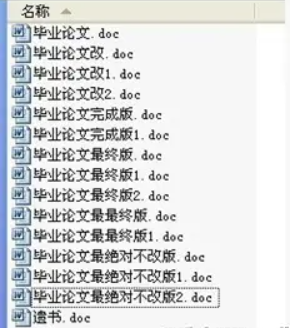

# 介绍 Git

动机: 怎么多人协作?

* 不是像几个人做英语的小组作业那样灾难
  * 一个文件被传几遍. 改了什么内容?
  * 这段文案是谁改的...? 为啥要改?
  * ...

<figure><figcaption><p>没有版本控制的灾难</p></figcaption></figure>

有了版本管理系统(VCS)就能解决大部分上面的问题.

* 别人都干了些啥?
* 同步项目
* 解决并行开发引起的冲突

我不和别人协作!

* 项目快照
* 记录改动目的
* 多分支并行开发

<figure><figcaption><p><a href="https://xkcd.com/1597/">XKCD 漫画</a>, 自嵌</p></figcaption></figure>

当一个接口侠

* Git 这么强大, 那要怎么实现 Git?
* 这是我该问的问题吗?
* Git 的后端模型很简洁. ~~虽然CLI接口太丑陋了~~
* 理解一定的原理, 至少能让你在复制命令的时候不会感到一脸茫然.

介绍下底层的设计和模型

### 存储结构

* 文件内容: Blob 对象 (**B**inary **L**arge **OB**ject)
* 对象: 对象按照 [SHA1-Hash](https://en.wikipedia.org/wiki/SHA-1#Data\_integrity) 寻址

`git hash-object`

```bash
$ git init git_demo
Initialized empty Git repository in /home/besthope/git_demo/.git/
$ cd git_demo
$ echo 'hello git' | git hash-object -w --stdin
8d0e41234f24b6da002d962a26c2495ea16a425f
$ git cat-file -p 8d0e41234f24b6da002d962a26c2495ea16a425f
hello git
```

* 历史记录的基本元素: 快照 (一个树)

```plaintext
<root> (tree)
|
+- foo (tree)
|  |
|  + bar.txt (blob, contents = "hello world")
|
+- baz.txt (blob, contents = "git is wonderful")
```

* 对象还可以是 Blob, Tree, Commit, Tag...

示例:

不同于传统的文件存储系统: key-value

* 文件的内容是 value
* 文件或目录有一个唯一的名称/路径作为 key

你不是修改了文件, 而是在另一个位置新建了文件

* 文件的内容是 value
* 根据内容计算一个 hash key, 这个哈希值相当于路径

什么是哈希函数? `strlen()` 就是一个哈希函数, 你可以知道字符串的长度, 但永远不知道原字符串是长什么样的.

packfiles

* 提交: 关联快照

commits are immutable

一个 commit ID 不仅和文件内容相关, 还和整个提交历史和仓库相关.

> Commits have "memory", but no premonition.

* 历史记录: 快照组成的有向无环图
* 引用: 指向提交的指针
  * 当前位置的索引: HEAD
* 标签: 对象的一个别名
  * 通常来说是某次 commit 后设定的一个版本号
* 仓库: 对象和引用
* 暂存区

对象引用其它对象时, 并不会真正储存对象, 只保存了他们的哈希值作为引用.

同时, 树本身会包含一些指向其他内容的指针.

看看代码 [Linus 的 first commit](https://github.com/git/git/commit/e83c5163316f89bfbde7d9ab23ca2e25604af290)

用 `cat-file` 显示对象

```plaintext
git cat-file -p e83c5163316f89bfbde7d9ab23ca2e25604af290
```

为Git祛魅: [Write Yourself a Git!](https://wyag.thb.lt/) 563 行 Python 代码实现了 Git 的全部重要机制.

[MIT CS教育缺失的一课: 版本控制(Git)](https://missing-semester-cn.github.io/2020/version-control/)

[Git crash course](https://www.youtube.com/watch?v=RGOj5yH7evk\&list=PLICH95IlQ1dRtYhrkmiqubOB6TGoZKrS5\&index=38)

用 ChatGPT 辅助你完成代码!

### 作业
