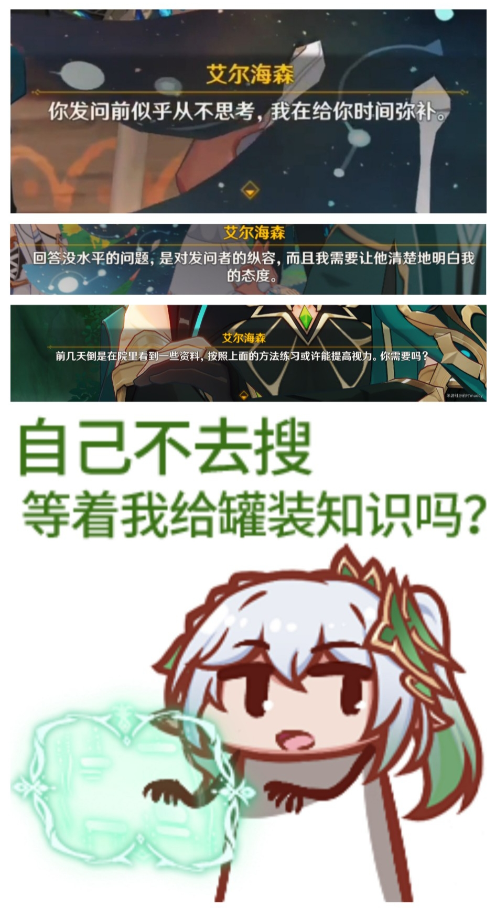

# Python 里技

你可能不知道的 Python 特性!

本文的读者:

* 想要写出模范代码, 让别人用的 (自己写库, 框架, 甚至语言...)
* 想要深入了解 Python 特性的
* 有一定 Python 基础的 (虽然我们会简单的回顾下)

## 回顾: Python 基础(可选)

## 示例 1: Nahida to Python

Nahida 很喜欢[编程](https://space.bilibili.com/546137543)(作为智慧之神那是必须的). 她从[官网](https://www.python.org/downloads/) Python 的新版本, 并已经添加到了系统的环境配置里. 为了检查这一点, 她在终端里键入了

```bash
$ python3 --version
Python 3.11.4
```

Nahida 之前从来没有接触过 Python! 为了体验与其它语言的不同, 她写了一个经典的 Hello world 程序 (`test.py`):

```python
hello, world = 'hello', 'world'    # multiple assignment
print(f'{hello} %s!' % (world))    # f-string, % operator (.format() is omitted here)
```

```
$ python3 -i test.py
hello world!
>>> world = 'python'
hello python
```

在交互(interactive)环境下, Nahida 又将打印的内容更改为了 `hello python!`

Nahida 又听说, Python 的数学运算非常强大, 据说自带高精度, 还有一些好用的内置方法, 而且还有 numpy, scipy 等库的加持(我们不太会用到), 于是她又测试了一些代码

```python
>>> (2 ** 114513 - 1) % 998244353
766171354
>>> x = 1172.5
>>> x.as_integer_ratio()
(2345, 2)
```

字符串处理也是不甘示弱:

```python
>>> text = 'The Temple of Wisdom'
>>> text[4:]
Temple of Wisdom
>>> 'Wisdom' in text
True
>>> text.lower()
'the temple of wisdom'
```

* 切片操作可以轻易获取一个字符串的子串
* `in` 关键字可以轻松判断字符串的包含关系
* 还有好多字符串方法...

以及内置的许多好用的数据结构: 列表(list), 元组(tuple), 字典(dict).


**字典尤其重要**. 其实字典就可以构成一个简单的数据库(对于一个真实的数据库, 表的数据关系更为复杂而已), 在我们编写接口的时候, 也必然需要处理这种映射关系. 我们返回数据的 JSON 格式通常就是这三个数据结构的嵌套.


&#x20;一些控制循环结构, 文件 I/O 的格式也很简洁: 例如, 打开一个文件, 读取每一行只需要这么做

```python
with opn('foo.txt', 'r') as f:
    for line in f:
        ...
```

对于 Python 里的函数, Nahida 了解到函数可以嵌套(高阶函数), 可以用函数式语言的方法去写. 如果你看不懂这个函数是干什么的, 你可以在 [python tutor](https://pythontutor.com/) 看的清楚点:

```bash
def cycle(f1, f2, f3):
    def ret_fn(n):
        def ret(x):
            if n == 0:
                return x
            return cycle(f2, f3, f1)(n - 1)(f1(x))
        return ret
return ret_fn
```

以上这些内容, 听说就是财大 Python 课程的全部. Nahida 听后, 立马把复习的讲义看了一遍, 然后将它们转换为了罐装知识放在这里.

<figure><figcaption><p>记得 STFW</p></figcaption></figure>

## Python OOP

OOP(Object-Oriented Programming), 面向对象编程.

在之前的 Python 开发中, 基本上不需要用到面向对象的概念, 但是在实际的开发项目中, 类(class)这一概念非常重要.

举个例子, 你要开发一款游戏, 现在设计怪物好了, 有史莱姆和哥布林, 现在需要你写代码, 你怎么写?

```
slime_hp, slime_atk, slime_xp = 10, 2, 10
goblin_hp, goblin_atk, goblin_xp = 15, 3, 20
```

写完你发现这样太麻烦了. 每种怪物都有血量, 攻击, 和经验值的属性, 如果能封装一个怪物的模型, 那么这样会更好.

于是就有了 class, 它类似于 C 语言里的结构体.

```python
class Monster:
    def __init__(self, name, hp, atk, xp):
        self.name = name
        self.hp = hp
        self.atk = atk
        self.xp = xp
```

这样之后创建一个怪物就简单多了. 例如

```python
slime = Monster('slime', 10, 2, 10)
```

如果我要创建多个史莱姆, 那么可以再将史莱姆作为一个类封装起来!

OOP 另一个重要的思想是继承(Inheritance). 假设我想给史莱姆设计一个特殊的机制, 例如弹跳, 这时候我要额外设计一个 slime 类, 但它同时需要怪物的这些属性和机制, 当然我们不需要复制粘贴过来, 继承机制就可以帮助我们实现这一点

```python
class Slime(Monster):
    def bounce():
        print('bounce!')
```

继承还有一个覆写, 或者说重载(override).

## 装饰器

## 语言特性

## 补充学习

* [python-mastery](https://github.com/dabeaz-course/python-mastery): 一个不错的 Python 进阶教程仓库. 亮点在于教程和练习写的很详细.
* [cs-61a](https://cs61a.org/): UCB 非常优质的公开课程, 富含精心准备的教案和代码练习. 这门课用 Python 讲 SICP 这本书, 不仅能让你上手 Python 编程, 还带你真正进入 CS 的世界.
