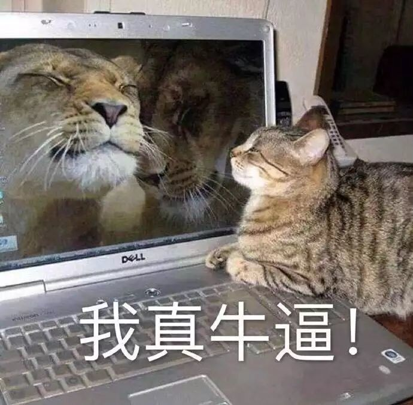

# 版本控制系统 Git

### 欢迎来到第一周的内容!

这一周, 我们将一起探索 Git 的世界:

* 它是一个强大又好用的版本控制系统
* 试试和你的小伙伴一起进行团队协作!
* 我们将探讨 Git 的基本概念, 工作原理, 和使用方式
* 掌握 Git 是每个开发者都应该具备的基本技能(_这也是为什么我们推荐其它部门的小伙伴来听这节课_)

此外, 为了更顺畅地进行后端相关的开发, 我们打算和各位一起巩固开发框架语言的基础, 同时, 我们也会简单涉及到一些进阶的内容.

最后, 我们会布置一些作业. 可能**会有些难**! 但是, it is worth it. 铭记我们求生手册里的那些话:


坚持到最后, 你就会发现: **你变强了**.


<figure><figcaption></figcaption></figure>
