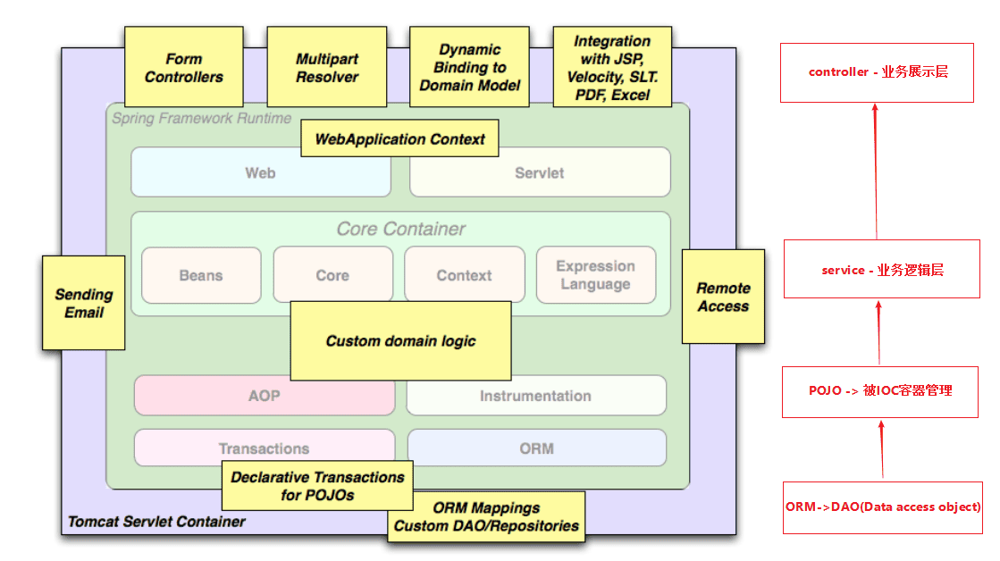

# springboot 入门

## 在springboot 之前
springboot框架是基于spring框架之上改进而来的。这一改进使得spring更加的轻量级，整合各种插件也更为方便。这种方便体现在使用maven配置相关环境时可以一步到位使用springboot推荐的基础配置而不用像spring一样长篇大论的写xml。


但就算springboot更为简单，我们依然需要对spring有一定的了解。


### spring

#### spring框架为何来
这是一个不能避而不谈的问题
1. 首先，对于Spring进阶，直接去看IOC和AOP，存在一个断层，所以需要整体上构建对Spring框架认知上进一步深入，这样才能构建知识体系。
2. 其次，很多开发者入门都是从Spring Boot开始的，他对Spring整体框架底层，以及发展历史不是很了解； 特别是对于一些老旧项目维护和底层bug分析没有全局观。
3. 再者，Spring代表的是一种框架设计理念，需要全局上理解Spring Framework组件是如何配合工作的，需要理解它设计的初衷和未来趋势。

#### spring框架能做什么？
spring的一个显著特点是分层。简单来说有如下几层：


- 业务展示层
  这一层用于与前端对接，接收前端发送的表单或其他数据格式，将其转化为易于处理的格式。一个典型的例子就是上一次提到的进阶作业中的fastjson，fastjson能够将前端传输过来的JSON格式字符串转换为java能够使用的java对象。
- 业务逻辑层
  在业务逻辑层中，程序员需要对各种类型的业务进行处理。正如在之后我们要引出的事务这一概念。我们在此层中处理数据之间的关系与辗转腾挪。
- POJO
  这一层用来与spring或springboot对接。对接中主要是包括类的注册，类的管理，类的实现。
- DAO（数据库交互）
  这一层将与数据库对接。在现代的java应用中，一般有一整套的工具用于数据库对接，包括sql的拼接，数据库的多线程，分表分库，均衡负载。这些中间件与你的应用一同协作应对越来越大的数据访问压力与安全问题。

#### 控制反转 - IOC
控制反转是一个经常被提及的看起来很高深的词汇。什么是控制反转？他又为什么能成为简化代码逻辑的重要部分？

来看第一个需求：查询用户（service通过调用dao查询pojo），本质上是如何创建User/Dao/Service等。

- 如果没有Spring框架，我们需要自己创建User/Dao/Service等，比如：
``` java
UserDaoImpl userDao = new UserDaoImpl();
UserSericeImpl userService = new UserServiceImpl();
userService.setUserDao(userDao);
List<User> userList = userService.findUserList();
```

- 但当我们使用springboot框架之后就可以将这些工作托管给Springboot

``` java
// create and configure beans
ApplicationContext context =
        new ClassPathXmlApplicationContext("aspects.xml", "daos.xml", "services.xml");

// retrieve configured instance
UserServiceImpl service = context.getBean("userService", UserServiceImpl.class);

// use configured instance
List<User> userList = service.findUserList();
```

1. 更进一步，你便能理解为何会有如下的知识点了：Spring框架管理这些Bean的创建工作，即由用户管理Bean转变为框架管理Bean，这个就叫**控制反转** - Inversion of Control (IoC)
2. Spring 框架托管创建的Bean放在哪里呢？ 这便是IoC Container;
3. Spring 框架为了更好让用户配置Bean，必然会引**入不同方式来配置Bean** 这便是xml配置，Java配置，注解配置等支持
4. Spring 框架既然接管了Bean的生成，必然需要管理**整个Bean的生命周期等**
5. 应用程序代码从Ioc Container中获取依赖的Bean，注入到应用程序中，这个过程叫 **依赖注入**(Dependency Injection，DI) 
   所以说控制反转是通过依赖注入实现的，其实它们是同一个概念的不同角度描述。通俗来说就是**IoC是设计思想，DI是实现方式**
6. 在依赖注入时，有哪些方式呢？这就是构造器方式，@Autowired, @Resource, @Qualifier... 同时Bean之间存在依赖（可能存在先后顺序问题，以及循环依赖问题等）

#### 面向切面-AOP

来看第二个需求：给Service所有方法调用添加日志（调用方法时），本质上是解耦问题；

- 如果没有Spring框架，我们需要在每个service的方法中都添加记录日志的方法，比如：
```java
/**
* find user list.
*
* @return user list
*/
public List<User> findUserList() {
    System.out.println("execute method findUserList");
    return this.userDao.findUserList();
}
```
- 有了Spring框架，通过@Aspect注解 定义了切面，这个切面中定义了拦截所有service中的方法，并记录日志； 可以明显看到，框架将日志记录和业务需求的代码解耦了，不再是侵入式的了
```java
/**
* aspect for every methods under service package.
*/
@Around("execution(* tech.pdai.springframework.service.*.*(..))")
public Object businessService(ProceedingJoinPoint pjp) throws Throwable {
    // get attribute through annotation
    Method method = ((MethodSignature) pjp.getSignature()).getMethod();
    System.out.println("execute method: " + method.getName());

    // continue to process
    return pjp.proceed();
}
```

更进一步，你便能理解为何会有如下的知识点了：
1. Spring 框架通过定义切面, 通过拦截切点实现了不同业务模块的解耦，这个就叫**面向切面编程** - Aspect Oriented Programming (AOP)
2. 为什么@Aspect注解使用的是aspectj的jar包呢？这就引出了Aspect4J和Spring AOP的历史渊源，只有理解了Aspect4J和Spring的渊源才能理解有些注解上的兼容设计
3. 如何支持更多拦截方式来实现解耦， 以满足更多场景需求呢？ 这就是@Around, @Pointcut... 等的设计
4. 那么Spring框架又是如何实现AOP的呢？ 这就引入代理技术，分静态代理和动态代理，动态代理又包含JDK代理和CGLIB代理等

#### spring 总结
##### spring 做到了什么？
Spring是Java企业版（Java Enterprise Edition，JEE，也称J2EE）的轻量级代替品。无需开发重量级的EnterpriseJavaBean（EJB），Spring为企业级Java开发提供了一种相对简单的方法，通过依赖注入和面向切面编程，
1. 用简单的Java对象（Plain Old Java Object，POJO）实现了EJB的功能。使用Spring的IOC容器,将对象之间的依赖关系交给Spring,降低组件之间的耦合性,让我们更专注于应用逻辑 
2. 可以提供众多服务,事务管理,WS等。 
3. AOP的很好支持,方便面向切面编程。 
4. 对主流的框架提供了很好的集成支持,如Hibernate,Struts2,JPA等 
5. Spring DI机制降低了业务对象替换的复杂性。 
6. Spring属于低侵入,代码污染极低。 
7. Spring的高度可开放性,并不强制依赖于Spring,开发者可以自由选择Spring部分或全部

##### spring 没有做到什么？
虽然Spring的组件代码是轻量级的，但它的配置却是重量级的。一开始，Spring用XML配置，而且是很多XML配置。Spring 2.5引入了基于注解的组件扫描，这消除了大量针对应用程序自身组件的显式XML配置。Spring 3.0引入了基于Java的配置，这是一种类型安全的可重构配置方式，可以代替XML。所有这些配置都代表了开发时的损耗。因为在思考Spring特性配置和解决业务问题之间需要进行思维切换，所以编写配置挤占了编写应用程序逻辑的时间。和所有框架一样，Spring实用，但与此同时它要求的回报也不少。
除此之外，项目的依赖管理也是一件耗时耗力的事情。在环境搭建时，需要分析要导入哪些库的坐标，而且还需要分析导入与之有依赖关系的其他库的坐标，一旦选错了依赖的版本，随之而来的不兼容问题就会严重阻碍项目的开发进度。
总而言之：
1. jsp中要写很多代码、控制器过于灵活,缺少一个公用控制器 
2. Spring不支持分布式,这也是EJB仍然在用的原因之一。
## springboot
SpringBoot解决上述Spring的缺点SpringBoot对上述Spring的缺点进行的改善和优化，基于约定优于配置的思想，可以让开发人员不必在配置与逻辑业务之间进行思维的切换，全身心的投入到逻辑业务的代码编写中，从而大大提高了开发的效率，一定程度上缩短了项目周期。
### springboot特点
SpringBoot的特点为基于Spring的开发提供更快的入门体验开箱即用，没有代码生成，也无需XML配置。同时也可以修改默认值来满足特定的需求提供了一些大型项目中常见的非功能性特性，如嵌入式服务器、安全、指标，健康检测、外部配置等SpringBoot不是对Spring功能上的增强，而是提供了一种快速使用Spring的方式
### SpringBoot的核心功能
- 起步依赖 
  起步依赖本质上是一个Maven项目对象模型（Project Object Model，POM），定义了对其他库的传递依赖，这些东西加在一起即支持某项功能。简单的说，起步依赖就是将具备某种功能的坐标打包到一起，并提供一些默认的功能。
- 自动配置
  Spring Boot的自动配置是一个运行时（更准确地说，是应用程序启动时）的过程，考虑了众多因素，才决定Spring配置应该用哪个，不该用哪个。该过程是Spring自动完成的。

在现代IDE中基本提供了对于springboot的完整支持。这一支持同样体现在IDEA中。下面将介绍如何在项目中安装与使用springboot，请配合视频食用。

### SpringBoot常用注解
1. `@SpringBootApplication`
	这个注解是Spring Boot最核心的注解，用在 Spring Boot的主类上，标识这是一个 Spring Boot 应用，用来开启 Spring Boot 的各项能力。
	实际上这个注解是`@Configuration`,`@EnableAutoConfiguration`,`@ComponentScan`这三个注解的组合。由于这些注解一般都是一起使用，所以Spring Boot提供了一个统一的注解`@SpringBootApplication`。

2. `@EnableAutoConfiguration`
	允许 Spring Boot 自动配置注解，开启这个注解之后，Spring Boot 就能根据当前类路径下的包或者类来配置 Spring Bean。
	例如当前类路径下有 Mybatis 这个 JAR 包，MybatisAutoConfiguration 注解就能根据相关参数来配置 Mybatis 的各个 Spring Bean。
	`@EnableAutoConfiguration`实现的关键在于引入了AutoConfigurationImportSelector，其核心逻辑为selectImports方法，逻辑大致如下：
	1. 从配置文件META-INF/spring.factories加载所有可能用到的自动配置类；
	2. 去重，并将exclude和excludeName属性携带的类排除；
	3. 过滤，将满足条件（@Conditional）的自动配置类返回；

3. `@Configuration`
	用于定义配置类，指出该类是 Bean 配置的信息源，相当于传统的xml配置文件，一般加在主类上。如果有些第三方库需要用到xml文件，建议仍然通过@Configuration类作为项目的配置主类——可以使用@ImportResource注解加载xml配置文件。

4. `@ComponentScan`

	组件扫描。让spring Boot扫描到Configuration类并把它加入到程序上下文。

	`@ComponentScan`注解默认就会装配标识了`@Controller`，`@Service`，`@Repository`，`@Component`注解的类到spring容器中。

5. `@Repository`
	用于标注数据访问组件，即DAO组件。
	使用`@Repository`注解可以确保DAO或者repositories提供异常转译，这个注解修饰的DAO或者repositories类会被ComponetScan发现并配置，同时也不需要为它们提供XML配置项。

6. `@Service`
	一般用于修饰service层的组件
7. `@RestController`
	用于标注控制层组件(如struts中的action)，表示这是个控制器bean,并且是将函数的返回值直 接填入HTTP响应体中,是REST风格的控制器；它是`@Controller`和`@ResponseBody`的合集。
8. `@ResponseBody`
	表示该方法的返回结果直接写入HTTP response body中
	一般在异步获取数据时使用，在使用`@RequestMapping`后，返回值通常解析为跳转路径，加上`@responsebody`后返回结果不会被解析为跳转路径，而是直接写入HTTP response body中。比如异步获取json数据，加上`@responsebody`后，会直接返回json数据。
9. `@Component`
	泛指组件，当组件不好归类的时候，我们可以使用这个注解进行标注。
10. `@Bean`
	相当于XML中的`<bean></bean>`,放在方法的上面，而不是类，意思是产生一个bean,并交给spring管理。
11. `@AutoWired`
	byType方式。把配置好的Bean拿来用，完成属性、方法的组装，它可以对类成员变量、方法及构造函数进行标注，完成自动装配的工作。
	当加上`(required=false)`时，就算找不到bean也不报错。
12. `@Qualifier`
	当有多个同一类型的Bean时，可以用@Qualifier("name")来指定。与`@Autowired`配合使用
13. `@Resource(name="name",type="type")`
	没有括号内内容的话，默认byName。与`@Autowired`干类似的事。
14. `@RequestMapping`
	RequestMapping是一个用来处理请求地址映射的注解；提供路由信息，负责URL到Controller中的具体函数的映射，可用于类或方法上。用于类上，表示类中的所有响应请求的方法都是以该地址作为父路径。
15. `@RequestParam`
	用在方法的参数前面。例：
	`@RequestParam String a =request.getParameter("a")`
16. `@PathVariable`
    将`@RequestMapping`中的路径变量提取到参数中。参数与大括号里的名字一样要相同。例：
	```java
	RequestMapping("user/get/mac/{macAddress}")

	public String getByMacAddress(@PathVariable String macAddress){
		//do something;

	}
	```
17. `@Profiles`
    Spring Profiles提供了一种隔离应用程序配置的方式，并让这些配置只能在特定的环境下生效。
	任何`@Component`或`@Configuration`都能被`@Profile`标记，从而限制加载它的时机。
	```java
	@Configuration
	
	@Profile("prod")
	
	public class ProductionConfiguration {
	
	    // ...
	
	}
	```
	
18. `@ConfigurationProperties`
    Spring Boot可使用注解的方式将自定义的properties文件映射到实体bean中，比如config.properties文件。
	```java
	@Data

	@ConfigurationProperties("rocketmq.consumer")

	public class RocketMQConsumerProperties extends 	RocketMQProperties {

	    private boolean enabled = true;

	    private String consumerGroup;

	    private MessageModel messageModel = MessageModel.	CLUSTERING;

	    private ConsumeFromWhere consumeFromWhere = 	ConsumeFromWhere.CONSUME_FROM_LAST_OFFSET;

	    private int consumeThreadMin = 20;

	    private int consumeThreadMax = 64;

	    private int consumeConcurrentlyMaxSpan = 2000;

	    private int pullThresholdForQueue = 1000;

	    private int pullInterval = 0;

	    private int consumeMessageBatchMaxSize = 1;

	    private int pullBatchSize = 32;

	}
	```