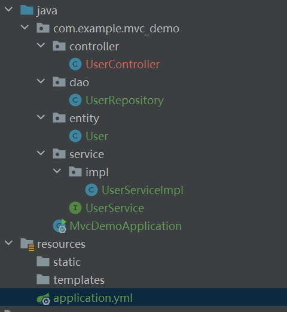

# Springboot JPA

## 经典的MVC三层架构三层架构(3-tier application)

通常意义上的三层架构就是将整个业务应用划分为：表现层（UI）、业务逻辑层（BLL）、数据访问层（DAL）。区分层次的目的即为了“高内聚，低耦合”的思想。

1. 表现层（UI）：通俗讲就是展现给用户的界面，即用户在使用一个系统的时候他的所见所得。
2. 业务逻辑层（BLL）：针对具体问题的操作，也可以说是对数据层的操作，对数据业务逻辑处理。
3. 数据访问层（DAL）：该层所做事务直接操作数据库，针对数据的增添、删除、修改、更新、查找等。

## 如何实现一个MVC架构？

<figure><figcaption></figcaption></figure>

1. 利用java的包机制将不同的部分分包。  上图中的项目就鲜明地分为了四个部分：controller，dao，entity，service，这四个部分。它们分别对应：表现层，数据访问层，类实体，业务逻辑层。
2. 在每个包的内部实现他们的功能。 使用严格的分离策略，除实体类之外，其他的类只使用这几个包中暴露出的方法而不直接接触被包的内部屏蔽掉的操作。
3. 完成啦！

## 每一层中的具体实现

### DAL

主要宗旨为与数据库进行交互。不直接参与数据的处理。一定要做好分层，想清楚究竟那个操作到放到dal中那个又不应该放入其中。 通用DAL层：

DAL又可以分为两类：

* 通用DAL层： 提供一个通用的DAL层的基础框架，其中包括所有实体类的基类，所有DAL类的基类，以及用来在实体类和数据表以及实体类字段和数据表字段之间Mapping的Attributes。此层作为核心框架只实现一次，此层通常不捕获任何异常 原则：提供通用的增删改查基础架构，提供实体类基础架构，提供ORMapping基础架构，面向所有表，此层以通用为目标，面向数据库。
* 专用DAL层： 基于通用DAL层的基础架构，为每个具体表提供一个实体类和一个DAL类，此层比通用DAL层的通用性稍差，这主要是为了给每个表提供一些专用的操作。此层以单表为中心，为针对单表的各种可能的访问提供专用方法，可以作为单表数据的入口。专用DAL层不捕获任何异常 专用DAL层的实体类和DAL类中的成员定义要向数据表对齐，函数定义中的参数要和存储过程的参数完全匹配。


原则：基于表，作为表入口


### BLL

以业务概念为核心组织业务处理过程，在业务处理过程中织入对专用DAL层的调用，BLL层通常通过捕获异常或执行业务逻辑检查（检查业务数据，如没有取到数据，或数据不符合当前业务等）来发现业务处理中的异常情况，并通过定义新的异常来向使用BLL的UI层提供更为面向业务的异常信息。

BLL层的实体类和BLL类的方法定义要向业务对象对齐，函数定义中的参数可以粗一些，直接传业务对象过来，尽管有时候只使用了其中的个别字段（如用于update status的方法一般就只使用业务对象中的ID和status）。


原则：基于业务逻辑来组织对专用DAL层的调用。


### UI

这一层主要负责应对前端发送过来的请求。只需要按照前端的需求返回即可，问题不大。


分层是否是绝对的？ 答案显然是否定的，一个典型的例子是现代的大型项目中出现了统一的normal层与common层这两侧用来处理一些公用的实体或其他类。 分层是一种实用的哲学，这是抽象这一技巧的体现。分或不分，这是一个问题。


## 与SQL的配合

可以注意到之前的演示代码中只使用了内存作为数据的保存位置。众所周知，一旦内存断电，你的数据就都不见了。所以我们要使用SQL来进行持久化操作。

### Springboot SQL Template

这是一个最基础的SQL支持，使用起来接近原生的SQL书写体验。建议新手一定要清楚如何使用SQL Template。使用JdbcTemplate我们提供自定义SQL, Spring执行这些SQL得到记录结果集。`JdbcTemplate`和`NamedParameterJdbcTemplate`类是自动配置的，您可以`@Autowire`注入到自己的Bean中。开箱即用。

`JdbcTemplate`执行完整的SQL语句，我们将SQL语句拼接好，交给`JdbcTemplate`执行，`JdbcTemplate`底层就是使用JDBC执行SQL语句。是JDBC的封装类而已。

`NamedParameterJdbcTemplate`可以在SQL语句部分使用“:命名参数”作为占位符, 对参数命名，可读性更好。`NamedParameterJdbcTemplate`包装了JdbcTemplate对象，“:命名参数”解析后，交给`JdbcTemplate`执行SQL语句。

`JdbcTemplateAutoConfiguration`自动配置了`JdbcTemplate`对象，交给`JdbcTemplateConfiguration`创建了`JdbcTemplate`对象。并对`JdbcTemplate`做了简单的初始设置（QueryTimeout，maxRows等）。

具体的操作见讲解之中。

## Springboot + Hibernate

使用`JdbcTemplate`的时候，我们用得最多的方法就是`List<T> query(String, RowMapper, Object...)`。这个`RowMapper`的作用就是把`ResultSet`的一行记录映射为Java Bean。

这种把关系数据库的表记录映射为Java对象的过程就是ORM：Object-Relational Mapping。ORM既可以把记录转换成Java对象，也可以把Java对象转换为行记录。

使用JdbcTemplate配合RowMapper可以看作是最原始的ORM。如果要实现更自动化的ORM，可以选择成熟的ORM框架，例如[Hibernate](https://hibernate.org/)。

### Spring中集成Hibernate。

Hibernate作为ORM框架，它可以替代JdbcTemplate，但Hibernate仍然需要JDBC驱动，所以，我们需要引入JDBC驱动、连接池，以及Hibernate本身。在Maven中，我们加入以下依赖项：

* org.springframework:spring-context:6.0.0
* org.springframework:spring-orm:6.0.0
* jakarta.annotation:jakarta.annotation-api:2.1.1
* jakarta.persistence:jakarta.persistence-api:3.1.0
* org.hibernate:hibernate-core:6.1.4.Final
* com.zaxxer:HikariCP:5.0.1
* org.hsqldb:hsqldb:2.7.1

在AppConfig中，我们仍然需要创建DataSource、引入JDBC配置文件，以及启用声明式事务：

```java
@Configuration
@ComponentScan
@EnableTransactionManagement
@PropertySource("jdbc.properties")
public class AppConfig {
    @Bean
    DataSource createDataSource() {
        ...
    }
}
```

#### 快速开始

为了启用Hibernate，我们需要创建一个LocalSessionFactoryBean：

```java
public class AppConfig {
    @Bean
    LocalSessionFactoryBean createSessionFactory(@Autowired DataSource dataSource) {
        var props = new Properties();
        props.setProperty("hibernate.hbm2ddl.auto", "update"); // 生产环境不要使用
        props.setProperty("hibernate.dialect", "org.hibernate.dialect.HSQLDialect");
        props.setProperty("hibernate.show_sql", "true");
        var sessionFactoryBean = new LocalSessionFactoryBean();
        sessionFactoryBean.setDataSource(dataSource);
        // 扫描指定的package获取所有entity class:
        sessionFactoryBean.setPackagesToScan("com.itranswarp.learnjava.entity");
        sessionFactoryBean.setHibernateProperties(props);
        return sessionFactoryBean;
    }
}
```

注意我们讲到过FactoryBean，`LocalSessionFactoryBean`是一个FactoryBean，它会再自动创建一个`SessionFactory`，在Hibernate中，`Session`是封装了一个JDBC Connection的实例，而`SessionFactory`是封装了JDBC DataSource的实例，即`SessionFactory`持有连接池，每次需要操作数据库的时候，`SessionFactory`创建一个新的`Session`，相当于从连接池获取到一个新的Connection。`SessionFactory`就是Hibernate提供的最核心的一个对象，但`LocalSessionFactoryBean`是Spring提供的为了让我们方便创建`SessionFactory`的类。

注意到上面创建`LocalSessionFactoryBean`的代码，首先用`Properties`持有Hibernate初始化`SessionFactory`时用到的所有设置，常用的设置请参考Hibernate文档，这里我们只定义了3个设置：

* hibernate.hbm2ddl.auto=update：表示自动创建数据库的表结构，注意不要在生产环境中启用；
* hibernate.dialect=org.hibernate.dialect.HSQLDialect：指示Hibernate使用的数据库是HSQLDB。Hibernate使用一种HQL的查询语句，它和SQL类似，但真正在“翻译”成SQL时，会根据设定的数据库“方言”来生成针对数据库优化的SQL；
* hibernate.show\_sql=true：让Hibernate打印执行的SQL，这对于调试非常有用，我们可以方便地看到Hibernate生成的SQL语句是否符合我们的预期。

除了设置`DataSource`和`Properties`之外，注意到`setPackagesToScan()`我们传入了一个package名称，它指示Hibernate扫描这个包下面的所有Java类，自动找出能映射为数据库表记录的JavaBean。后面我们会仔细讨论如何编写符合Hibernate要求的JavaBean。

紧接着，我们还需要创建`HibernateTransactionManager`：

```java
public class AppConfig {
    @Bean
    PlatformTransactionManager createTxManager(@Autowired SessionFactory sessionFactory) {
        return new HibernateTransactionManager(sessionFactory);
    }
}
```

`HibernateTransactionManager`是配合Hibernate使用声明式事务所必须的。到此为止，所有的配置都定义完毕，我们来看看如何将数据库表结构映射为Java对象。

考察如下的数据库表：

```sql
CREATE TABLE user(
    id BIGINT NOT NULL AUTO_INCREMENT,
    email VARCHAR(100) NOT NULL,
    password VARCHAR(100) NOT NULL,
    name VARCHAR(100) NOT NULL,
    createdAt BIGINT NOT NULL,
    PRIMARY KEY (`id`),
    UNIQUE KEY `email` (`email`)
);
```

其中，id是自增主键，email、password、name是VARCHAR类型，email带唯一索引以确保唯一性，createdAt存储整型类型的时间戳。用JavaBean表示如下：

```java
public class User {
    private Long id;
    private String email;
    private String password;
    private String name;
    private Long createdAt;

    // getters and setters
    ...
}
```

这种映射关系十分易懂，但我们需要添加一些注解来告诉Hibernate如何把`User`类映射到表记录：

```java
@Entity
public class User {
    @Id
    @GeneratedValue(strategy = GenerationType.IDENTITY)
    @Column(nullable = false, updatable = false)
    public Long getId() { ... }

    @Column(nullable = false, unique = true, length = 100)
    public String getEmail() { ... }

    @Column(nullable = false, length = 100)
    public String getPassword() { ... }

    @Column(nullable = false, length = 100)
    public String getName() { ... }

    @Column(nullable = false, updatable = false)
    public Long getCreatedAt() { ... }
}
```

如果一个JavaBean被用于映射，我们就标记一个`@Entity`。默认情况下，映射的表名是user，如果实际的表名不同，例如实际表名是users，可以追加一个`@Table(name="users")`表示：

```java
@Entity
@Table(name="users)
public class User {
    ...
}
```

每个属性到数据库列的映射用`@Column()`标识，nullable指示列是否允许为NULL，updatable指示该列是否允许被用在UPDATE语句，length指示String类型的列的长度（如果没有指定，默认是255）。

对于主键，还需要用`@Id`标识，自增主键再追加一个`@GeneratedValue`，以便Hibernate能读取到自增主键的值。


细心的童鞋可能还注意到，主键id定义的类型不是long，而是Long。这是因为Hibernate如果检测到主键为null，就不会在INSERT语句中指定主键的值，而是返回由数据库生成的自增值，否则，Hibernate认为我们的程序指定了主键的值，会在INSERT语句中直接列出。long型字段总是具有默认值0，因此，每次插入的主键值总是0，导致除第一次外后续插入都将失败。

createdAt虽然是整型，但我们并没有使用long，而是Long，这是因为使用基本类型会导致findByExample查询会添加意外的条件，这里只需牢记，作为映射使用的JavaBean，所有属性都使用包装类型而不是基本类型。

使用Hibernate时，不要使用基本类型的属性，总是使用包装类型，如Long或Integer。


#### 提取基类

类似的，我们再定义一个`Book`类：

```java
@Entity
public class Book {
    @Id
    @GeneratedValue(strategy = GenerationType.IDENTITY)
    @Column(nullable = false, updatable = false)
    public Long getId() { ... }

    @Column(nullable = false, length = 100)
    public String getTitle() { ... }

    @Column(nullable = false, updatable = false)
    public Long getCreatedAt() { ... }
}
```

如果仔细观察`User`和`Book`，会发现它们定义的id、createdAt属性是一样的，这在数据库表结构的设计中很常见：对于每个表，通常我们会统一使用一种主键生成机制，并添加createdAt表示创建时间，updatedAt表示修改时间等通用字段。

不必在User和Book中重复定义这些通用字段，我们可以把它们提到一个抽象类中：

```java
@MappedSuperclass
public abstract class AbstractEntity {

    private Long id;
    private Long createdAt;

    @Id
    @GeneratedValue(strategy = GenerationType.IDENTITY)
    @Column(nullable = false, updatable = false)
    public Long getId() { ... }

    @Column(nullable = false, updatable = false)
    public Long getCreatedAt() { ... }

    @Transient
    public ZonedDateTime getCreatedDateTime() {
        return Instant.ofEpochMilli(this.createdAt).atZone(ZoneId.systemDefault());
    }

    @PrePersist
    public void preInsert() {
        setCreatedAt(System.currentTimeMillis());
    }
}
```

对于`AbstractEntity`来说，我们要标注一个`@MappedSuperclass`表示它用于继承。此外，注意到我们定义了一个`@Transient`方法，它返回一个“虚拟”的属性。因为`getCreatedDateTime()`是计算得出的属性，而不是从数据库表读出的值，因此必须要标注`@Transient`，否则Hibernate会尝试从数据库读取名为createdDateTime这个不存在的字段从而出错。

再注意到`@PrePersist`标识的方法，它表示在我们将一个JavaBean持久化到数据库之前（即执行INSERT语句），Hibernate会先执行该方法，这样我们就可以自动设置好`createdAt`属性。

有了`AbstractEntity`，我们就可以大幅简化`User`和`Book`：

```java
@Entity
public class User extends AbstractEntity {

    @Column(nullable = false, unique = true, length = 100)
    public String getEmail() { ... }

    @Column(nullable = false, length = 100)
    public String getPassword() { ... }

    @Column(nullable = false, length = 100)
    public String getName() { ... }
}
```

注意到使用的所有注解均来自`jakarta.persistence`，它是JPA规范的一部分。这里我们只介绍使用注解的方式配置Hibernate映射关系，不再介绍传统的比较繁琐的XML配置。通过Spring集成Hibernate时，也不再需要hibernate.cfg.xml配置文件，用一句话总结：


使用Spring集成Hibernate，配合JPA注解，无需任何额外的XML配置。


类似`User`、`Book`这样的用于ORM的Java Bean，我们通常称之为Entity Bean。

#### 增删改查

最后，我们来看看如果对user表进行增删改查。因为使用了Hibernate，因此，我们要做的，实际上是对`User`这个`JavaBean`进行“增删改查”。我们编写一个`UserService`，注入`SessionFactory`：

```java
@Component
@Transactional
public class UserService {
    @Autowired
    SessionFactory sessionFactory;
}
```

*   Insert操作 要持久化一个User实例，我们只需调用persist()方法。以register()方法为例，代码如下：

    ```java
    public User register(String email, String password, 	String name) {
        // 创建一个User对象:
        User user = new User();
        // 设置好各个属性:
        user.setEmail(email);
        user.setPassword(password);
        user.setName(name);
        // 不要设置id，因为使用了自增主键
        // 保存到数据库:
        sessionFactory.getCurrentSession().persist(user);
        // 现在已经自动获得了id:
        System.out.println(user.getId());
        return user;
    }
    ```
*   Delete操作 删除一个User相当于从表中删除对应的记录。注意Hibernate总是用id来删除记录，因此，要正确设置User的id属性才能正常删除记录：

    ```java
    public boolean deleteUser(Long id) {
        User user = sessionFactory.getCurrentSession().	byId(User.class).load(id);
        if (user != null) {
            sessionFactory.getCurrentSession().remove	(user);
            return true;
        }
        return false;
    }
    ```

    通过主键删除记录时，一个常见的用法是先根据主键加载该记录，再删除。注意到当记录不存在时，load()返回null。
*   Update操作 更新记录相当于先更新User的指定属性，然后调用merge()方法：

    ```java
    public void updateUser(Long id, String name) {
        User user = sessionFactory.getCurrentSession().	byId(User.class).load(id);
        user.setName(name);
        sessionFactory.getCurrentSession().merge(user);
    }
    ```

    前面我们在定义`User`时，对有的属性标注了`@Column(updatable=false)`。Hibernate在更新记录时，它只会把`@Column(updatable=true)`的属性加入到UPDATE语句中，这样可以提供一层额外的安全性，即如果不小心修改了`User`的email、createdAt等属性，执行`update()`时并不会更新对应的数据库列。但也必须牢记：这个功能是Hibernate提供的，如果绕过Hibernate直接通过JDBC执行UPDATE语句仍然可以更新数据库的任意列的值。
*   Query操作 最后，我们编写的大部分方法都是各种各样的查询。根据id查询我们可以直接调用load()，如果要使用条件查询，例如，假设我们想执行以下查询：

    ```sql
    SELECT * FROM user WHERE email = ? AND password = ?
    ```

    我们来看看可以使用什么查询。

    1.  使用HQL查询 一种常用的查询是直接编写Hibernate内置的HQL查询：

        ```java
        List<User> list = sessionFactory.getCurrentSession	()
                .createQuery("from User u where u.email = ?1 	and u.password = ?2", User.class)
                .setParameter(1, email).setParameter(2, 	password)
                .list();
        ```

        和SQL相比，HQL使用类名和属性名，由Hibernate自动转换为实际的表名和列名。详细的HQL语法可以参考Hibernate文档。
    2.  NaneQuery 除了可以直接传入HQL字符串外，Hibernate还可以使用一种NamedQuery，它给查询起个名字，然后保存在注解中。使用NamedQuery时，我们要先在User类标注：

        ```java
        @NamedQueries(
            @NamedQuery(
                // 查询名称:
                name = "login",
                // 查询语句:
                query = "SELECT u FROM User u WHERE u.email = 		:e AND u.password = :pwd"
            )
        )
        @Entity
        public class User extends AbstractEntity {
            ...
        }
        ```

        注意到引入的`NamedQuery`是`jakarta.persistence.NamedQuery`，它和直接传入HQL有点不同的是，占位符使用:e和:pwd。

        使用NamedQuery只需要引入查询名和参数：

        ```java
        public User login(String email, String password) {
            List<User> list = sessionFactory.getCurrentSession		()
                .createNamedQuery("login", User.class) // 创建		NamedQuery
                .setParameter("e", email) // 绑定e参数
                .setParameter("pwd", password) // 绑定pwd参数
                .list();
            return list.isEmpty() ? null : list.get(0);
        }
        ```

        直接写HQL和使用NamedQuery各有优劣。前者可以在代码中直观地看到查询语句，后者可以在User类统一管理所有相关查询。

### Springboot JPA

上一节我们讲了在Spring中集成Hibernate。Hibernate是第一个被广泛使用的ORM框架，但是很多小伙伴还听说过JPA：Java Persistence API，这又是啥？

在讨论JPA之前，我们要注意到JavaEE早在1999年就发布了，并且有Servlet、JMS等诸多标准。和其他平台不同，Java世界早期非常热衷于标准先行，各家跟进：大家先坐下来把接口定了，然后，各自回家干活去实现接口，这样，用户就可以在不同的厂家提供的产品进行选择，还可以随意切换，因为用户编写代码的时候只需要引用接口，并不需要引用具体的底层实现（想想JDBC）。

JPA就是JavaEE的一个ORM标准，它的实现其实和Hibernate没啥本质区别，但是用户如果使用JPA，那么引用的就是jakarta.persistence这个“标准”包，而不是org.hibernate这样的第三方包。因为JPA只是接口，所以，还需要选择一个实现产品，跟JDBC接口和MySQL驱动一个道理。

我们使用JPA时也完全可以选择Hibernate作为底层实现，但也可以选择其它的JPA提供方，比如EclipseLink。Spring内置了JPA的集成，并支持选择Hibernate或EclipseLink作为实现。这里我们仍然以主流的Hibernate作为JPA实现为例子，演示JPA的基本用法。

和使用Hibernate一样，我们只需要引入如下依赖：

* org.springframework:spring-context:6.0.0
* org.springframework:spring-orm:6.0.0
* jakarta.annotation:jakarta.annotation-api:2.1.1
* jakarta.persistence:jakarta.persistence-api:3.1.0
* org.hibernate:hibernate-core:6.1.4.Final
* com.zaxxer:HikariCP:5.0.1
* org.hsqldb:hsqldb:2.7.1

实际上我们这里引入的依赖和上一节集成Hibernate引入的依赖完全一样，因为Hibernate既提供了它自己的接口，也提供了JPA接口，我们用JPA接口就相当于通过JPA操作Hibernate。

然后，在AppConfig中启用声明式事务管理，创建`DataSource`：

```java
@Configuration
@ComponentScan
@EnableTransactionManagement
@PropertySource("jdbc.properties")
public class AppConfig {
    @Bean
    DataSource createDataSource() { ... }
}
```

使用Hibernate时，我们需要创建一个`LocalSessionFactoryBean`，并让它再自动创建一个`SessionFactory`。使用JPA也是类似的，我们也创建一个`LocalContainerEntityManagerFactoryBean`，并让它再自动创建一个`EntityManagerFactory`：

```java
@Bean
public LocalContainerEntityManagerFactoryBean createEntityManagerFactory(@Autowired DataSource dataSource) {
    var emFactory = new LocalContainerEntityManagerFactoryBean();
    // 注入DataSource:
    emFactory.setDataSource(dataSource);
    // 扫描指定的package获取所有entity class:
    emFactory.setPackagesToScan(AbstractEntity.class.getPackageName());
    // 使用Hibernate作为JPA实现:
    emFactory.setJpaVendorAdapter(new HibernateJpaVendorAdapter());
    // 其他配置项:
    var props = new Properties();
    props.setProperty("hibernate.hbm2ddl.auto", "update"); // 生产环境不要使用
    props.setProperty("hibernate.dialect", "org.hibernate.dialect.HSQLDialect");
    props.setProperty("hibernate.show_sql", "true");
    emFactory.setJpaProperties(props);
    return emFactory;
}
```

观察上述代码，除了需要注入`DataSource`和设定自动扫描的package外，还需要指定JPA的提供商，这里使用Spring提供的一个`HibernateJpaVendorAdapter`，最后，针对Hibernate自己需要的配置，以Properties的形式注入。

最后，我们还需要实例化一个`JpaTransactionManager`，以实现声明式事务：

```java
@Bean
PlatformTransactionManager createTxManager(@Autowired EntityManagerFactory entityManagerFactory) {
    return new JpaTransactionManager(entityManagerFactory);
}
```

这样，我们就完成了JPA的全部初始化工作。有些童鞋可能从网上搜索得知JPA需要persistence.xml配置文件，以及复杂的orm.xml文件。这里我们负责地告诉大家，使用Spring+Hibernate作为JPA实现，无需任何配置文件。

所有Entity Bean的配置和上一节完全相同，全部采用Annotation标注。我们现在只需关心具体的业务类如何通过JPA接口操作数据库。

还是以UserService为例，除了标注`@Component`和`@Transactional`外，我们需要注入一个`EntityManager`，但是不要使用`Autowired`，而是`@PersistenceContext`：

```java
@Component
@Transactional
public class UserService {
    @PersistenceContext
    EntityManager em;
}
```

我们回顾一下JDBC、Hibernate和JPA提供的接口，实际上，它们的关系如下：

|    JDBC    |    Hibernate   |          JPA         |
| :--------: | :------------: | :------------------: |
| DataSource | SessionFactory | EntityManagerFactory |
| Connection |     Session    |     EntityManager    |

`SessionFactory`和`EntityManagerFactory`相当于`DataSource`，`Session`和`EntityManager`相当于`Connection`。每次需要访问数据库的时候，需要获取新的`Session`和`EntityManager`，用完后再关闭。


但是，注意到`UserService`注入的不是`EntityManagerFactory`，而是`EntityManager`，并且标注了`@PersistenceContext`。难道使用JPA可以允许多线程操作同一个`EntityManager`？

实际上这里注入的并不是真正的`EntityManager`，而是一个`EntityManager`的代理类，相当于：

```java
public class EntityManagerProxy implements EntityManager {
    private EntityManagerFactory emf;
}
```

Spring遇到标注了`@PersistenceContext`的`EntityManager`会自动注入代理，该代理会在必要的时候自动打开`EntityManager`。换句话说，多线程引用的`EntityManager`虽然是同一个代理类，但该代理类内部针对不同线程会创建不同的`EntityManager`实例。

简单总结一下，标注了`@PersistenceContext`的`EntityManager`可以被多线程安全地共享。


因此，在`UserService`的每个业务方法里，直接使用`EntityManager`就很方便。以主键查询为例：

```java
public User getUserById(long id) {
    User user = this.em.find(User.class, id);
    if (user == null) {
        throw new RuntimeException("User not found by id: " + id);
    }
    return user;
}
```

与HQL查询类似，JPA使用JPQL查询，它的语法和HQL基本差不多：

```java
public User fetchUserByEmail(String email) {
    // JPQL查询:
    TypedQuery<User> query = em.createQuery("SELECT u FROM User u WHERE u.email = :e", User.class);
    query.setParameter("e", email);
    List<User> list = query.getResultList();
    if (list.isEmpty()) {
        return null;
    }
    return list.get(0);
}
```

同样的，JPA也支持`NamedQuery`，即先给查询起个名字，再按名字创建查询：

```java
public User login(String email, String password) {
    TypedQuery<User> query = em.createNamedQuery("login", User.class);
    query.setParameter("e", email);
    query.setParameter("pwd", password);
    List<User> list = query.getResultList();
    return list.isEmpty() ? null : list.get(0);
}
```

`NamedQuery`通过注解标注在`User`类上，它的定义和上一节的`User`类一样：

```java
@NamedQueries(
    @NamedQuery(
        name = "login",
        query = "SELECT u FROM User u WHERE u.email=:e AND u.password=:pwd"
    )
)
@Entity
public class User {
    ...
}
```

对数据库进行增删改的操作，可以分别使用persist()、remove()和merge()方法，参数均为Entity Bean本身，使用非常简单，这里不再多述。
