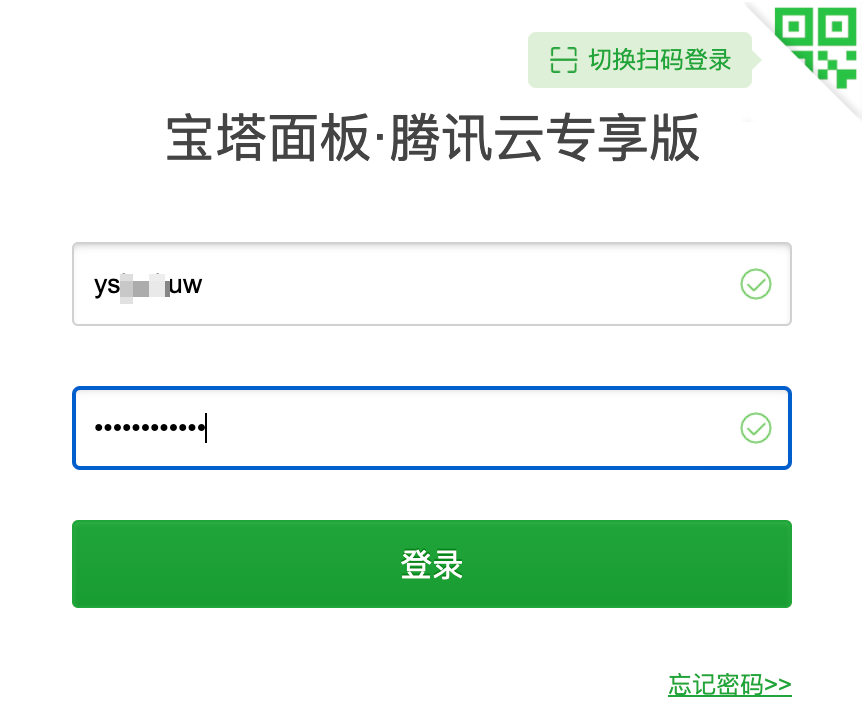

# 服务器部署

## 前言

草履虫都能轻易学会的服务器部署方法.

我们介绍一个_国产的_服务器管理软件: [宝塔面板](https://www.bt.cn/new/index.html).&#x20;

你可能会说, 我是猛男, 我要学最原始的方式配置. 试着去完成 MySQL 的数据库配置以及 Python 的运行环境, 设置虚拟主机, 部署 SSL, 同步服务器......

* 当你一套操作学了半天还出了一大堆配置问题后, 隔壁用上工具的同学早就摸鱼摸到天上去了.
* 当你折腾半天终于搞定外包项目的部署时, 你发现为了赶 DDL 连着熬了好几天的夜.

**所以, 珍视你的开发效率. 把时间落到实处.** 啥方便我们就用啥, 就好像 Git 有集成的图形化可以用, 就少用点 CLI.

<figure><figcaption><p>开发没问题, 肯定是运维的问题 (</p></figcaption></figure>

你可能会说: 我就一臭写代码的. 明明是后端的, 管这个干啥. 不应该让运维工程师去做吗?

当然, 负责的来说, 后端的成员_理应_要对这部分熟悉一些, 因为在中小型项目中运维的担子确实可以分担给开发干, 不然奇点应该新建一个运维部门😂

此外, 在互联网的相关竞赛中, 可能你半天找不到一个专精运维的同学, 你也不能指望前端的同学帮你部署网站吧? 到最后部署环节还得是咱们自己丰衣足食. 我们暑训也是想让大家了解全套后端开发的流程, 总之就是多多益善.

在本节: 我们会浮光掠影地**介绍服务器的大致流程**, 然后给出**利用图形化工具(宝塔)的最佳实践**.

还别忘了我们的远大理想: **我们既懂原理, 也懂得如何去操作!**


虽然但是, 你可能不知道, 宝塔的 Web 后端就是用 Flask 写的. 它的接口甚至是[开源](https://github.com/aaPanel/BaoTa)的! 也支持第三方拓展, 也有较为良好的社区支持. 从这些角度来说, 宝塔已经算是良心软件了.

所以, 作为初学时的工具, 为什么不去试试呢?


## 部署一个服务器要做哪些事?

让我们 AskGPT 吧!

1. **选择服务器和操作系统：** 首先需要选择适合你网站需求的服务器，可以是虚拟主机、VPS（虚拟专用服务器）或物理服务器。然后选择操作系统，常见的有Linux发行版如Ubuntu、CentOS等，或Windows Server。
2. **获取服务器访问权限：** 获取服务器的访问权限，通常是通过SSH（对于Linux）或远程桌面（对于Windows）来实现。
3. **安装必要的软件和服务：** 根据你的网站技术栈，安装所需的软件和服务，如Web服务器（如Nginx、Apache）、数据库（如MySQL、PostgreSQL）、编程语言环境（如Node.js、Python、PHP）等。
4. **上传网站文件：** 将网站文件（HTML、CSS、JavaScript、图片等）上传到服务器，可以通过FTP、SCP等工具进行。
5. **配置域名和DNS：** 如果有域名，需要将域名解析指向服务器的IP地址，并设置DNS记录，以确保访问者可以通过域名访问你的网站。
6. **配置Web服务器：** 配置Web服务器以处理网站请求。你需要创建虚拟主机配置（Nginx）或站点配置（Apache），设置反向代理、SSL证书等。
7. **配置数据库：** 如果你的网站需要使用数据库，确保数据库服务器已正确安装并配置。创建数据库、用户，并将网站需要的数据导入数据库中。
8. **设置安全性措施：** 针对服务器和应用程序，配置防火墙、安全组，限制不必要的访问，并确保采取安全措施来保护敏感数据和防止攻击。
9. **配置备份策略：** 设置定期备份策略，确保网站数据和配置的定期备份，以防止数据丢失或损坏。
10. **测试网站功能：** 在服务器上测试网站，确保所有功能和页面都能正常访问和运行，修复任何问题。
11. **性能优化：** 针对网站性能，优化数据库查询、资源加载速度等，以提供更好的用户体验。
12. **监控和日志：** 设置监控系统来实时监测服务器状态、网站性能和流量。确保日志记录正常，以便在出现问题时进行故障排除。
13. **上线网站：** 当你确认一切就绪并且网站能够正常运行时，就可以将网站上线，让用户可以访问。
14. **持续维护：** 定期检查服务器和应用程序的安全性，及时应用系统更新和补丁，保持网站的正常运行。

## 实践: 宝塔面板结合腾讯云

### 整一个服务器!

腾讯云/阿里云等云服务器提供商和宝塔面板有着很好的集成度, 实际上免去了你在服务器里再度安装的麻烦. 我们本次示例就选用腾讯云作为服务器的平台.

首先你需要一个可供使用的云服务器. 腾讯云账号注册后会提供一些[免费体验](https://cloud.tencent.com/act/pro/free\_person?from=18732)的服务. 你可以利用这个上手学习使用服务器的相关操作.


如果你曾经注册过, 并已经体验过这些免费套餐了怎么办? No worries, 别忘了我们是学生.

腾讯云和阿里云都为学生提供了[校园云服务器](https://cloud.tencent.com/act/campus?from=18733), 一个轻量的服务器一年的租赁费也不过100出头的价格: 想想你在其它互联网软件会员包年的费用也远不止这点. 如果你有部署项目的需要, 这是很值得的一笔费用.


当你入手了一个全新的服务器以后, 选择宝塔Linux面板 8.0.0 腾讯云专享版的一个应用模板, 其它的一些参数可以参考[购买方式](https://cloud.tencent.com/document/product/1207/44580). 稍微等待一下, 你就有了这样的一个应用.

<figure><figcaption><p>腾讯云控制台里的宝塔 Linux 面板</p></figcaption></figure>

在服务器页面中, 找到防火墙, 选择添加规则, 放通 8888 端口

<figure><figcaption><p>放通端口</p></figcaption></figure>


宝塔 Linux 面板腾讯云专属版的默认端口为 8888. 在登录面板里可以后续更改这个端口, 届时相应开放对应的端口即可.


点击登录, 它会打开腾讯云的一个 [OrcaTerm](https://cloud.tencent.com/document/product/1665) 页面, 简单来说这是一个更易上手的终端软件. 初次配置按照默认用户名 Lighthouse 登录即可. 进入之后, 你应该能看到终端的提示了

```bash
[lighthouse@VM-4-17-centos ~]$
```

下一步, 在终端里键入

```bash
sudo /etc/init.d/bt default
```

<figure><figcaption><p>获取账号与密码</p></figcaption></figure>

然后访问这里的外网面板地址. 这里宝塔面板的用户名和密码就是这里默认生成的.

<figure><figcaption><p>登录面板</p></figcaption></figure>

登录成功以后, 需要绑定宝塔账号. 没有账号的就快速注册一下就可以了.

绑定完成以后, 在弹出的关联腾讯云 API 密钥窗口里, 输入相关的参数即可.

<figure><figcaption><p>关联 API</p></figcaption></figure>


API 密钥代表一个人的账号身份和所拥有的权限, 等同于账号密码, 切勿泄露给他人!

* APPID: 在[账号中心](https://console.cloud.tencent.com/developer)获取.
* 密钥 ID 和 Key: 在 [API 密钥管理页面](https://console.cloud.tencent.com/cam/capi)获取.

至于是否需要创建子账号访问云 API, 对于我们个人开发者而言无需过于担心. 但在团队协作中, 如果你是项目的管理者, 最好按照[文档](https://cloud.tencent.com/document/product/598/10592)进行.


这样我们全套流程就解决啦! 然后就可以在宝塔面板中安装环境相关的事宜啦.

<figure><figcaption><p>宝塔面板</p></figcaption></figure>

在自己的机子上远程访问服务器(开启 SSH 登录)

```bash
besthope:~$ ssh root@...
root@...'s password:
Last login: Tue Aug 22 12:12:38 2023 from 127.0.0.1
[root@VM-4-17-centos ~]# ls
```


你可能首先需要在宝塔面板安装一个 Linux 工具箱, 更改下 root 密码, 才能登录上本地服务器的 root 账号.

至于有无必要设置 ssh 密钥登录? 要是你不嫌麻烦就可以.


想在 Windows 下远程访问你需要先安装 [OpenSSH](https://learn.microsoft.com/zh-cn/windows-server/administration/openssh/openssh\_install\_firstuse), 之后还可以在 vscode 里远程连接! 你可能需要在这个过程中参考[这篇文章](https://zixizixi.cn/windows\_vscode\_ssh\_error\_bad-owner-or-permissions).

<figure><figcaption><p>vscode 里 ssh 连接到自己的服务器</p></figcaption></figure>

### 部署 Flask 项目

写一个简单的 Flask 示例

```python
from flask import Flask

app = Flask(__name__)

@app.route('/')
def index():
    return 'hello my server!'

if __name__ == '__main__':
    app.run(host='0.0.0.0', port=5000)
```

备好 requirements.txt 文件 (用 pip freeze 写入也可以). 然后你有两种选择:

1. 直接生成 zip 文件! 我们把工程里的全部文件打包成 test.zip 文件

```bash
zip -q -r test.zip *
```

在 wsl 你可以用 `explorer.exe .` 打开当前目录.

2. 用 Git 上传远程仓库, 然后在远程仓库下载 zip 文件. 我们更推荐这种方法, 因为有些文件例如缓存文件 \_\_pycache\_\_, venv 之类的我们并不想一起传上去.

然后把它复制到服务器的 `/www/wwwroot` 目录下. 双击就可以解压.

<figure><figcaption><p>最好放到这里, 不然之后可能会出事.</p></figcaption></figure>

在**软件商店**里安装一个 Python 项目管理器, 随便选一个稳定版本安装.

<figure><figcaption><p>添加一个 Python 项目</p></figcaption></figure>

* 框架我们修改成 Flask
* 启动方式我们就采用默认的 python
* 项目路径就是我们刚才解压后的那个路径. 剩下的类似.
* 下面三个选项建议勾上, 安装模块依赖会自动读取 requirements.txt 安装依赖.

一套流程跑完, 你可能会发现项目无法正常启动.

* 例如, log 里会提示 `ModuleNotFoundError: No module named 'flask'`, 原因是我们本地 flask 版本 2.3.3 过高, 而服务器 pip 下载的镜像源里 flask 最高版本还是2.3.2.
  * 不过这不是一个特别大的问题, 我们在 Python 项目管理器 > \[你的项目] > 模块 里手动安装即可.

<figure><figcaption><p>模块管理</p></figcaption></figure>

* 你可能需要在安全 > 系统防火墙里添加一个 Flask 应用实例占用的端口, 例如上面的示例里是 5000.
* 建议在腾讯云的防火墙里也添加这个一个端口.

之后我们就可以访问你的服务器 IP:端口, 例如 [http://101.34.90.2:5000/](http://101.34.90.2:5000/) 就是我部署的一个网站, 试试访问它!

<figure><figcaption><p>成功访问!</p></figcaption></figure>

### 一些进阶的话题

* 配置 Nginx
* 域名绑定
* 安装SSL证书
* 数据库操作
* Docker 部署项目
* 部署其它框架: Django, Spring Boot...
* 一并部署前端项目, 例如 Vue, 前后端联系
* 持续集成和持续部署

能力/时间有限, 这部分就留给未来想要部署服务器的同学去探索了.

## 拓展阅读

1. 宝塔面板的[官方文档](https://www.kancloud.cn/chudong/bt2017/431320). 如果你多做一步搜索的话, 你就能看到[腾讯云](https://cloud.tencent.com/document/product/1207/54078)/[阿里云](https://developer.aliyun.com/article/767481)使用宝塔面板的文档了.
2. [连前端都看得懂的《Nginx 入门指南》](https://juejin.cn/post/6844904129987526663): 这是在瞧不起我们后端的成员吗? 必须给他搞懂了.
